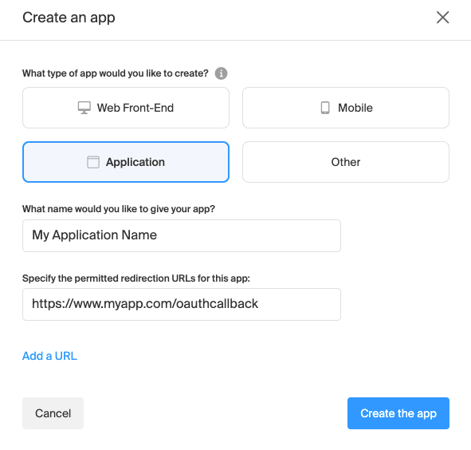
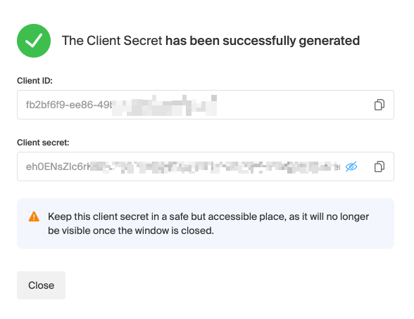
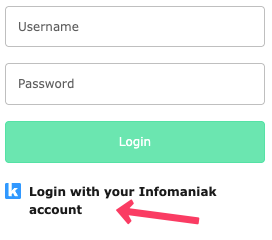
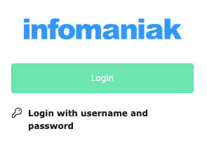

# TYPO3 Extension: Infomaniak Auth
[](https://typo3.org/)
[](https://typo3.org/)
[](LICENSE)
[](ext_emconf.php)

---

## ✨ Fonctionnalités
- 🔐 Authentication via Infomaniak
- 👥 Automatic TYPO3 user account creation
- 🔄 Data sync (email, first name, last name)
- 🏷️ Assignment to TYPO3 user groups

---
## 📥 Installation

### Requirements
- TYPO3 v12+
- Infomaniak account with a configured Auth app

```bash
composer require infomaniak/t3ext-infomaniak-auth
```

---
### ⚙️ Configuration

1. Create an Auth application in the Infomaniak Manager

You need an Infomaniak account and must configure an Auth application in the Infomaniak Manager.

Go to the Cloud Computing section and choose the Auth application. Then click on "Create a new application".



Next, fill in the following information:
- **What type of app would you like to create?** : Choose "Application"
- **What name would you like to give your app?** : Enter the name of your application
- **Specify the permitted redirection URLs for this app**: The homepage URL of your TYPO3 site, ending with /oauthcallback (e.g., https://www.myapp.com/oauthcallback)

You can then retrieve the **Client ID** and **Client Secret** for your application.



2. Configure the extension in the TYPO3 backend:

Once the extension is installed, you need to configure the authentication module.

- Go to **Admin Tools > Settings > Extension Configuration**
- Select the extension **infomaniak_auth**
- Configure the extension settings

#### Client configuration
- In the first tab, provide the following details :
  - **Client ID**: Provided by Infomaniak when creating the application
  - **Client Secret**: Provided by Infomaniak when creating the application
  - **Client Scopes** : Scopes to be used for authentication (default: `openid email profile`)

#### Authentification Backend
In the second tab, you can configure authentication for the TYPO3 backend.

#### Authentification Frontend
In the third tab, you can configure authentication for the TYPO3 frontend.

#### Server configuration
In the last tab, you can configure the various endpoints for the Infomaniak authentication server. **You normally shouldn’t need to modify these settings.**

---
## Login into TYPO3

### Authentification Backend
Once the extension is installed and configured, you can log in to the TYPO3 backend using your Infomaniak account.

1. Choose to login with your Infomaniak account.



2. Click on the "Login" button.



You will be redirected to Infomaniak’s login page. After authentication, you will be logged into the TYPO3 backend.

### Authentification Frontend

To allow users to log in to your website's frontend, you need to add the Infomaniak Auth plugin to a page.

This plugin will display a login button. When the visitor clicks the button, they will be redirected to the Infomaniak login page.

Upon return, they will be logged in to the TYPO3 frontend.


